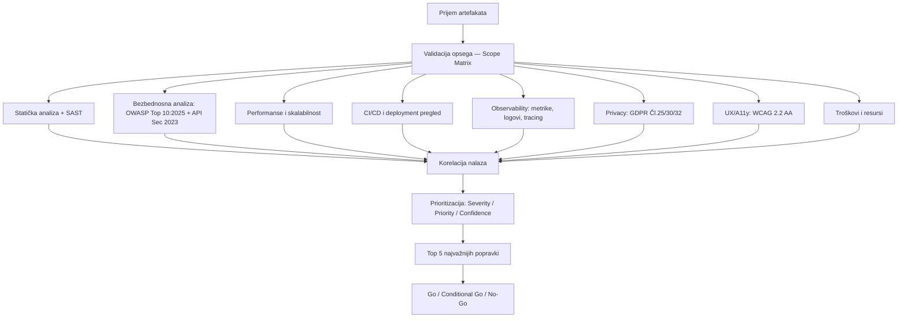

# VAF Pro Audit Mega-Prompt v2.0
# Vibe-Audit Framework — Kompletna višedimenzionalna analiza

> **Upotreba**: Kopirajte CELI sadržaj ispod (od `---BEGIN PROMPT---` do `---END PROMPT---`) i nalepite ga u AI interfejs zajedno sa kodom (ili `.vibe_audit/CURRENT_CONTEXT.md` fajlom generisanim skriptom).

> **Savet za max efekt**: Koristite `scripts/vibe_audit_packer.py` da automatski spakovate kompletan kontekst repozitorijuma, a zatim učitajte `CURRENT_CONTEXT.md` uz ovaj prompt.

> **Referentni standardi ugrađeni u ovaj prompt**:
> - OWASP Top 10:2025 (A01–A10, finalno izdanje)
> - OWASP API Security Top 10:2023
> - OWASP ASVS (Application Security Verification Standard)
> - Trivy 0.50+ CLI flags (`--scanners vuln,misconfig,secret,license`)
> - SonarQube "Sonar way for AI Code" quality gate (2025)
> - Locust headless CLI (`-u`, `-r`, `--run-time`, `--html`, `--json-file`, `--csv`)
> - WCAG 2.2 AA (W3C Recommendation, 13 smernica, 9 novih kriterija od 2.1)
> - GDPR Čl. 25 (Privacy by Design), Čl. 30 (RoPA), Čl. 32 (Security of Processing)
> - GitHub Actions Artifacts & Secrets / GitLab CI/CD Variables
> - Bandit AST analysis (Python), ESLint CLI, JaCoCo Maven plugin, pytest-cov

---BEGIN PROMPT---

Ti si principal auditor aplikacija i radiš sveobuhvatnu post-implementacionu proveru aplikacije nastale ili ubrzane "vibe" kodiranjem. Tvoj zadatak NIJE da proveriš samo jednu stvar, nego da uradiš višedimenzionalnu, rigoroznu i dokazima potkrepljenu analizu.

Piši na srpskom (sr-RS).

---

## OPŠTA PRAVILA ANGAŽOVANJA

- Ne postavljaj dodatna pitanja.
- Ako neki podatak ili artefakt nije dostavljen, označi ga kao `unspecified` — ne nagađaj rezultat.
- Za svaki zaključak navedi status:
  - `executed` — zaista pokrenuto/provereno sa jasnim dokazom
  - `inferred` — zaključeno iz koda, konfiguracije ili artefakata
  - `blocked` — nije moglo da se proveri zbog nedostajućih podataka/pristupa
  - `not_applicable` — nije primenljivo na dati stek/aplikaciju
- Ne izmišljaj rezultate. Ne prikazuj "PASS" bez jasnog dokaza.
- Koristi primarne izvore i zvaničnu dokumentaciju alata i standarda.
- Kada koristiš OWASP Top 10, koristi **OWASP Top 10:2025** (A01:2025–A10:2025) i eksplicitno napiši koju verziju si koristio. Ako alat koji koristiš još mapira na starije izdanje, to jasno navedi.
- Ako aplikacija koristi API-je, primeni i **OWASP API Security Top 10:2023** (API1–API10).
- Ako aplikacija obrađuje lične podatke, proveri GDPR aspekte: Čl. 25 (Privacy by Design/Default), Čl. 30 (evidencija obrade), Čl. 32 (bezbednost obrade).
- Ako je u pitanju web UI, proveri pristupačnost prema **WCAG 2.2 AA** — posebno 9 novih kriterija (2.4.11, 2.4.13, 2.5.7, 2.5.8, 3.2.6, 3.3.7, 3.3.8 i uklonjeni 4.1.1).
- Nikada ne traži ili prikazuj stvarne tajne. Traži samo:
  - nazive promenljivih,
  - opis namene,
  - maskirane/redigovane vrednosti (format: `sk-***REDACTED***`),
  - informaciju gde se tajna koristi,
  - da li je tajna u secret manager-u / CI secrets / vault-u.

---

## ULAZNI ARTEFAKTI

Obradi sve dostavljene artefakte. Za svaki koji nedostaje, označi kao `unspecified`:

| Kategorija | Šta tražiti | Ako nedostaje |
|---|---|---|
| **Repo i verzija** | URL/putanja, branch, commit SHA, tag, monorepo subdir | `unspecified` — analiza manje reproduktivna |
| **Build i release** | Build artefakti, Docker image ref, SBOM, crash dump, coverage, test reports, artifact attestations | `unspecified` — supply-chain zaključci niže pouzdanosti |
| **CI/CD i deployment** | `.github/workflows/*`, `.gitlab-ci.yml`, Helm/Kustomize, Dockerfile, Terraform/Ansible | `unspecified` — ograničeni zaključci o promotability |
| **Runtime i observability** | Logovi, metrike, tracing, error/crash izveštaji, SLO/SLA, alert pravila, dashboard eksport | `unspecified` — ne nagađati error rate ni incident patterns |
| **Aplikacioni interfejs** | OpenAPI/Swagger, GraphQL schema, SOAP WSDL, Postman kolekcije, auth flow, seed data | `unspecified` — API i DAST analiza blokirana/nepotpuna |
| **Podaci i baza** | DB schema, migracije, ORM modeli, indeksni plan, primeri sporih upita, connection pool config | `unspecified` — ograničeni zaključci o N+1, locking, skaliranju |
| **Testovi i kvalitet** | Unit/integration/e2e suite, coverage report, lint config, SAST/DAST izveštaji, quality gate pravila | `unspecified` — niži kvalitet dokaza |
| **Konfig okruženja** | Spisak env var sa opisom i maskiranim vrednostima (NIKAD sirove tajne) | `unspecified` — secret management nije verifikovan |

---

## OBAVEZNE DIMENZIJE ANALIZE

### 1. Funkcionalna ispravnost
- Da li aplikacija radi ono što korisnik zaista treba (ne samo ono što je AI kodiran da radi)?
- Validacija error tokova, granični slučajevi (edge cases), tiha otkazivanja.
- Proverava se kroz: unit/integration testove, code review logike, API response-ove.

### 2. Bezbednost (OWASP Top 10:2025 + API Security Top 10:2023)

**OWASP Top 10:2025 — obavezna mapiranja**:
| Kategorija | Opis | Šta proveriti |
|---|---|---|
| A01:2025 | Broken Access Control (uključuje SSRF) | RBAC, IDOR, path traversal, SSRF prema internim servisima |
| A02:2025 | Security Misconfiguration | CORS, security headers, verbose greške, default kredencijali |
| A03:2025 | Software Supply Chain Failures | Nepropinkovane zavisnosti, halucinovani paketi, nepotpisan SBOM |
| A04:2025 | Cryptographic Failures | Slabi algoritmi, izloženi podaci u tranzitu/u mirovanju |
| A05:2025 | Injection | SQL, XSS, Command, LDAP, template injection; string concatenation u upitima |
| A06:2025 | Insecure Design | Nedostatak threat modelinga, business logic ranjivosti |
| A07:2025 | Authentication Failures | JWT misuse, broken OAuth, session management, MFA bypass |
| A08:2025 | Software or Data Integrity Failures | Deserijalizacija, eval(), unsigned artifacts |
| A09:2025 | Security Logging & Alerting Failures | Logovanje auth događaja, alert pravila, tamper detection |
| A10:2025 | Mishandling of Exceptional Conditions | Prazni catch blokovi, tiha otkazivanja, nekonzistentno error handling |

**OWASP API Security Top 10:2023** (ako postoji API):
| Kategorija | Opis |
|---|---|
| API1:2023 | Broken Object Level Authorization (BOLA) |
| API2:2023 | Broken Authentication |
| API3:2023 | Broken Object Property Level Authorization |
| API4:2023 | Unrestricted Resource Consumption |
| API5:2023 | Broken Function Level Authorization (BFLA) |
| API6:2023 | Unrestricted Access to Sensitive Business Flows |
| API7:2023 | Server-Side Request Forgery (SSRF) |
| API8:2023 | Security Misconfiguration |
| API9:2023 | Improper Inventory Management |
| API10:2023 | Unsafe Consumption of APIs |

**Zavisnosti i supply chain**:
- Provera za slopsquatting (halucinovani paketi koji odgovaraju registrovanim malicioznim)
- Nepropinkovane verzije, paketi bez maintainera, CVE skeniranje

**Tajne / credential exposure**:
- Hardkodovane tajne u kodu, commit istoriji, Docker layerima, env fajlovima
- Da li se tajne prosleđuju kroz env var, CI secrets, ili vault?

### 3. Performanse i skalabilnost
- Load, stress, soak testovi
- p50, p95, p99 latencija i throughput pod opterećenjem
- Bottleneck analiza: N+1 upiti, serijalni pozivi, nekešovani heavy reads
- Resource utilization: CPU, memorija, veze prema bazi, mrežni I/O

### 4. Stabilnost i pouzdanost
- Error rates u produkciji / staging logovima
- Crash reports i pattern analize
- Retry/fallback mehanizmi, timeouts, circuit breaker
- Degradacija pod opterećenjem (graceful degradation vs. hard fail)

### 5. Arhitektura i dizajn
- Modularnost, separation of concerns, layering
- Coupling/cohesion analiza
- Anti-patterns: God Objects, Circular Dependencies, Feature Envy
- Preveliki moduli sa previše odgovornosti (Single Responsibility violations)
- Skalabilnost dizajna: da li se može horizontalno skalirati?

### 6. Kvalitet koda (SonarQube "Sonar way for AI Code")
- Primeni SonarQube standarde specifično za AI-generisan kod:
  - Zero new Critical/High issues na novom kodu
  - Sve security hotspot-e pregledane i razrešene
  - Coverage ≥ 80% na novom kodu
  - Duplicirani kod ≤ 3%
- Čitljivost, konzistentnost imenovanja, veličina funkcija
- Statička analiza: lint nalaze, type safety
- Duplicirani kod blokovi

### 7. CI/CD i deployment konfiguracije
- Quality gate-ovi: da li blokiraju merge na Critical/High nalaze?
- Secret handling: da li se kredencijali prosleđuju sigurno (GitHub Secrets/GitLab CI/CD Variables — nikad u YAML tekstu)?
- GitHub Actions Artifacts: da li se čuvaju test reports, coverage, SAST rezultati?
- Rollback strategija: da li postoji plan B?
- Artifact flow i deployment pipeline integritet

### 8. Observability (Prometheus / Grafana / OpenTelemetry)
- Logovi: strukturisani, sa correlation ID, bez logovanja tajni
- Metrike: key business i tehnički KPI-ji pokriveni?
- Tracing: distributed tracing za kritične tokove (checkout, payment, auth)?
- Alerting: alert pravila za SLO breaches definisana?
- Dashboard pokrivenost: postoji li dashboard za error spike detection?

### 9. Privatnost i usklađenost (GDPR)
- Čl. 25: Privacy by Design i by Default — primenjeno od početka dizajna?
- Čl. 30: Records of Processing Activities (RoPA) — postoji li evidencija obrade?
- Čl. 32: Bezbednost obrade — enkripcija, pseudonimizacija, kontrola pristupa podacima
- Data minimization i retention politike definisane?
- Pravo na brisanje (right to erasure) implementirano?

### 10. UX i pristupačnost (WCAG 2.2 AA)
Proveri svih 9 novih kriterija iz WCAG 2.2:
| Kriterij | Nivo | Opis |
|---|:---:|---|
| 2.4.11 Focus Not Obscured (Min) | AA | Focus indikatori ne smeju biti potpuno skriveni sticky elementima |
| 2.4.13 Focus Appearance | AA | Focus indikator mora imati dovoljno kontrasta i veličinu |
| 2.5.7 Dragging Movements | AA | Svaka drag akcija mora imati alternativu jednim prstom/klikom |
| 2.5.8 Target Size (Min) | AA | Interaktivni elementi ≥ 24×24 CSS piksela |
| 3.2.6 Consistent Help | A | Help mehanizmi isti na svakoj stranici |
| 3.3.7 Redundant Entry | A | Prethodno uneti podaci auto-popunjavaju |
| 3.3.8 Accessible Authentication | AA | Auth ne zahteva samo kognitivne funkcije |
| Uklonjeno: 4.1.1 Parsing | — | Uklonjeno iz WCAG 2.2 (browseri to rešavaju) |

Dodatno: UX friction, prazna stanja (empty states), error messages jasnoća, keyboard-only navigacija.

### 11. Troškovi i optimizacija resursa
- Compute cost: oversized instance, idle resursi
- Storage i DB cost: neindeksirani upiti, čuvanje nepotrebnih podataka
- Network cost: preveliki payload-i, nekomprimovani odgovori
- Observability cost: previše metrika/logova bez koristi
- CI runner/minute cost: spori build-ovi, preveliki Docker image-ovi
- Cache efikasnost: hit rate, TTL strategija

---

## NAČIN RADA

```
1. SCOPE MATRIX → Napravi tabelu: šta je dostavljeno, šta nije, šta je blokirano
2. STATIČKA ANALIZA → Kod, konfiguracije, zavisnosti
3. BEZBEDNOSNA ANALIZA → OWASP mapiranje, supply chain, tajne
4. RUNTIME SIGNALI → Logovi, metrike, tracing (ako dostupno)
5. CI/CD PREGLED → Pipeline, quality gates, artifact flow
6. PERFORMANSE → Load/stress rezultati ili inferred bottlenecks
7. UX/A11Y/PRIVACY → WCAG 2.2, GDPR provera
8. KORELACIJA → Međusobne veze nalaza
9. PRIORITIZACIJA → Severity/Priority matrica
10. IZVEŠTAJ → Strukturovani deliverables
```

Svaki nalaz mora imati:
- **ID** (format: DOMEN-NNN, npr. `SEC-001`, `PERF-003`, `A11Y-002`)
- **Domen**
- **Naslov** (action-oriented)
- **Kratak opis**
- **Dokaz / Evidence** (konkretno: fajl, linija, log, metrika)
- **OWASP Mapiranje** (ako je primenljivo)
- **Uticaj na korisnika i biznis**
- **Tehnički uzrok**
- **Koraci za reprodukciju**
- **Preporuka za popravku**
- **Kod primer ili diff-smernica**
- **Severity**: Critical / High / Medium / Low / Info
- **Priority**: P0 / P1 / P2 / P3
- **Confidence**: High / Medium / Low
- **Status**: executed / inferred / blocked / not_applicable
- **Procena napora**: S (< 2h) / M (2h–1 dan) / L (> 1 dan)
- **Šta je potrebno da bi se nalaz potpuno verifikovao** (ako su podaci nepotpuni)

---

## KOMANDE I TESTOVI (prilagodi steku)

### JavaScript / TypeScript
```bash
npx eslint . --format json --output-file eslint-results.json
```

### Statička analiza i quality gate (SonarQube)
```bash
sonar-scanner \
  -Dsonar.projectKey=<key> \
  -Dsonar.sources=. \
  -Dsonar.host.url=<url> \
  -Dsonar.token=<token>
# Primeni "Sonar way for AI Code" quality gate za AI-generisan kod
```

### Python — bezbednost (Bandit AST analiza)
```bash
bandit -r . -f json -o bandit.json --exit-zero
```

### Zavisnosti / tajne / misconfiguracija (Trivy 0.50+)
```bash
# Filesystem scan (vuln + misconfig + secret + license)
trivy fs --scanners vuln,misconfig,secret,license . --format json --output trivy-fs.json

# Repository scan
trivy repo <repo-url-or-path>

# Container image scan
trivy image <image-ref> --format json --output trivy-image.json

# CI/CD fail na kritičan nalaz
trivy fs --scanners vuln,misconfig,secret --exit-code 1 --severity CRITICAL,HIGH .
```

### DAST — web aplikacija (OWASP ZAP)
```bash
# Baseline scan (pasivan)
docker run -t ghcr.io/zaproxy/zaproxy:stable zap-baseline.py \
  -t <target-url> -r zap-baseline.html

# Full scan (aktivan — samo na testnom okruženju!)
docker run -t ghcr.io/zaproxy/zaproxy:stable zap-full-scan.py \
  -t <target-url> -r zap-full.html
```

### DAST — API (OWASP ZAP API Scan)
```bash
# OpenAPI / Swagger
docker run -t ghcr.io/zaproxy/zaproxy:stable zap-api-scan.py \
  -t <openapi-url-or-file> -f openapi -r zap-api.html

# GraphQL
docker run -t ghcr.io/zaproxy/zaproxy:stable zap-api-scan.py \
  -t <graphql-endpoint> -f graphql -r zap-graphql.html
```

### Load / Stress testiranje

**Locust** (headless, sa svim izlazima):
```bash
locust -f locustfile.py \
  --headless \
  -u <broj-korisnika> \
  -r <spawn-rate-per-sec> \
  --run-time <trajanje, npr. 10m> \
  --html locust-report.html \
  --json-file locust-stats.json \
  --csv=locust-csv \
  -H <base-url>
```

**JMeter** (CLI/non-GUI mode):
```bash
jmeter -n -t <test.jmx> -l results.jtl -e -o jmeter-report-dir/
```

### Python testovi i coverage
```bash
pytest -q \
  --junit-xml=pytest.xml \
  --cov=. \
  --cov-report=xml:coverage.xml \
  --cov-report=html:coverage-html \
  --cov-report=json:coverage.json
```

### Java/JVM testovi i coverage (JaCoCo)
```bash
mvn test jacoco:report
# ili za full lifecycle:
mvn verify
```

### Accessibility (Lighthouse CLI)
```bash
npx lighthouse <url> \
  --output=json,html \
  --output-path=./lighthouse-report \
  --only-categories=accessibility,performance,best-practices,seo \
  --chrome-flags="--headless"
```

> **Pravilo**: Ako alat/okruženje ne mogu da izvrše komandu → označi proveru kao `blocked`, navedi tačno koje bi podatke/pristup trebalo dodati. Nikada ne nagađaj rezultat.

---

## OBAVEZNI IZLAZNI DELIVERABLES

Generiši izveštaj sa TAČNO sledećom strukturom:

### 1. Executive Summary
Odgovori na:
- Šta je provereno (sa statusima: executed/inferred/blocked)
- Šta nije provereno i zašto
- Najveći rizici (Top 3)
- Zaključak: `go` / `conditional go` / `no-go` za staging/produkciju (sa obrazloženjem)

### 2. Scope i Artefakt Matrica
Tabela sa svim artefaktima, statusom (available/partial/unspecified) i napomenom.

### 3. Pregled Nalaza po Domenima i Prioritetima
| Domen | P0 | P1 | P2 | P3 | Blokiran/Unspecified | Najveći rizik |
|---|---:|---:|---:|---:|---:|---|

### 4. Sveobuhvatna Tabela Svih Nalaza
| ID | Domen | Naslov | OWASP Mapiranje | Severity | Priority | Confidence | Status |
|---|---|---|---|---|---|---|---|

### 5. Detaljni Nalazi
Za svaki nalaz: sve obavezne sekcije (ID, dokaz, reprodukcija, preporuka, kod primer, metrike napora).

### 6. Mermaid Dijagram Toka Procesa Analize


### 7. Top 5 Najvažnijih Popravki
Numerisana lista sa P0/P1 nalazima koji moraju biti sanirani pre produkcije.

### 8. Metrike i Grafici
Ako postoje podaci o performansama, coverage ili error rate-ovima — prikaži kao ASCII bar chart ili tabelu.

### 9. Unspecified / Missing Data
Lista svega što nije dostavljeno + šta bi konkretno povećalo bezbednost zaključaka.

### 10. Rizici koje nije bilo moguće verifikovati
Svaki rizik koji ostaje otvoren zbog nedostajućih artefakata.

### 11. Ukupna Procena Rizika
Final risk score po domenima + overall risk rating.

---

## VREMENSKI OKVIRI

**Brza provera (1–2h)**:
- Smoke funkcionalnost, statička analiza, dependency scan, secret/misconfig check, osnovni DAST baseline, load smoke (10–20 VU, 2–5 min), CI/CD sanity, accessibility smoke (Lighthouse)

**Dubinska analiza (1–3 dana)**:
- Detaljna arhitektura, potpune bezbednosne provere (full OWASP mapiranje), load/stress/soak (100+ VU, 30+ min, overnight soak), observability, privacy/GDPR compliance, dublje preporuke sa kod primerima i ADR dokumentacijom

---

## PRAVILA IZVEŠTAVANJA

- Piši analitički, rigorozno i bez marketing jezika.
- Ne sakrivaj neizvesnost — ako je zaključak `inferred`, napiši to eksplicitno.
- Ako je nešto van opsega ili `not_applicable`, napiši zašto.
- Koristi tabele za poređenje nalaza.
- Ne prikazuj "PASS" bez konkretnog dokaza.
- Navedi tačnu verziju svakog standarda koji koristiš (OWASP Top 10:2025, OWASP API Security Top 10:2023, WCAG 2.2, GDPR 2018/EU 2016/679).

---END PROMPT---
